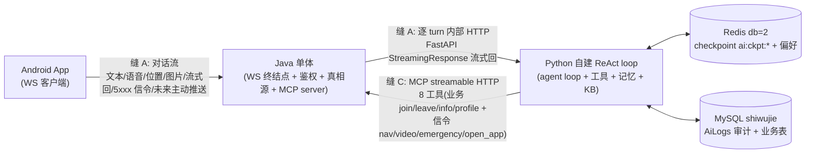
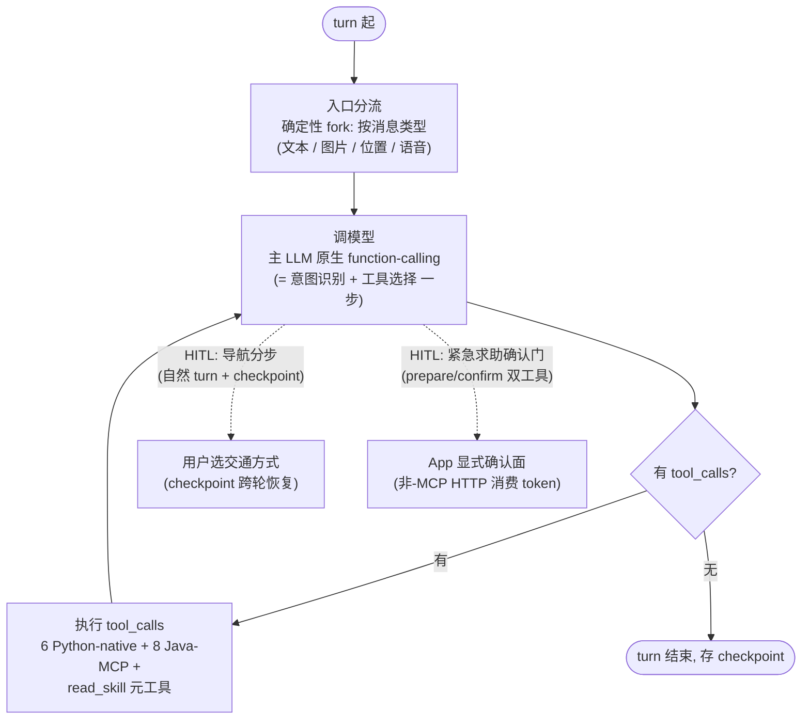

# AI 重写架构（polyglot 双进程）

> 跨切面概览：把现有 Java AI 模块整体替换为 Python 自建 ReAct loop 智能体（langchain-core 地基），Java 业务单体保留作网关——**设计敲定（Phase 1-4）· 实现待 Phase 5**。本篇是 AI 重写的总图与选型论证，单模块实现细节（类名 / `file:line` / 数据流 / 缺陷）下沉 [shiwujie-backend/docs/](../../shiwujie-backend/docs/) 与未来的 `shiwujie-ai/docs/`。用户可见契约（AI 通道变更、求助信令、记住偏好、导航分步确认）在 [product/current.md](../product/current.md)。

> **实现载体（2026-07-18 终定）**：**自建 ReAct loop**（langchain-core `ChatModel`/`@tool`/`Message` + 手写 `while` + 复用 `langchain-mcp-adapters`/LangSmith），**不引 LangGraph**。v1 复杂度（标准 ReAct 环 + 自然 turn HITL，无 `interrupt`/子图/状态机）用不上 graph 原语，逐原语自建不亏（详见 [shiwujie-ai/docs/design.md](../../shiwujie-ai/docs/design.md) ⑪）；LangGraph 留作撞墙升级路径。本文原 "agent 环（LangGraph）/ State / 节点 / 条件边 / checkpointer" 已换 "自建 loop / 对话上下文 / 入口分流·调模型·执行 tool_calls / while / 手写 checkpoint" 语境。

> 状态约定：本文所有「将 / 会 / 目标态」均为设计态，未落地。凡涉及现有 Java AI 模块的描述（工作流式路由、自研记忆、弃用 ReAct、半残留 RAG、qwen 止血）均为**弃用对象**，重写后整体替换。

## 一、定位

AI 重写 = **把 Java AI 模块的计算职责迁出，落成独立的 Python 自建 ReAct loop 智能体进程（langchain-core 地基）；Java 业务单体保留并承担网关角色**。重写后的形态是 **polyglot 双进程**：

| 进程 | 角色 | 职责 | 是否持用户 JWT |
|---|---|---|---|
| Java 业务单体（bootstrap） | 网关 / 真相源 | WS 终结点 + JWT/Redis 鉴权 + 业务真相源 + MCP server（暴露 8 工具） | 是（唯一鉴权边缘） |
| Python 自建 ReAct loop | 计算大脑 | agent loop（langchain-core）+ 14 工具 + 两层记忆 + BM25 知识库 | **否**（Java 鉴权后内部传 blind_id） |

Java 单体仍是业务真相源与鉴权边界，Python 仅作无状态的计算大脑——**不持用户 JWT、不直接面向公网**。鉴权链路见 [`auth.md`](auth.md)；现状 Java AI 模块的实现细节见 [`../../shiwujie-backend/docs/modules/ai.md`](../../shiwujie-backend/docs/modules/ai.md)。

## 二、诚实选型理由

两层选择：**为什么 Python（不 Java）** + **为什么自建 loop（不 LangGraph）**。

**为什么 Python（不 Java）**——**不是因为「Java 做不到 graph / checkpoint / interrupt」**（红队已证伪：`spring-ai-alibaba-graph` 1.0 GA 在本项目已用的 alibaba-bom 1.0.0.2 内，确有这些原语）。诚实理由有三：

1. **Python AI 生态更成熟**——本项目已被 spring-ai-alibaba 从 M6.1 到 1.0.0.2 反复坑（远不止一次）；langchain-core / OpenAI 兼容生态是 agent 主战场，工具链 / 文档 / 社区验证密度高于年轻移植。
2. **解耦已反复踩坑的 Alibaba 模型绑定**——项目已踩坑：`spring-ai-alibaba` 1.0.0.2 的 `DashScopeChatModel` 调 qwen3.x 文本模型报 `url error`，止血改 `OpenAiChatModel`（见 [`tech-stack.md`](tech-stack.md) AI 能力栈）。Python 侧 langchain-core `ChatOpenAI` 经 OpenAI 兼容端点解耦模型绑定，降低再被坑风险。
3. **学可迁移的设计层**——AI 时代语言渐非约束，真正可迁移的是容错 / 并发 / 架构设计（语言无关）；成熟 Python 生态是更好的老师；且 alibaba-graph 本是 LangGraph 移植、设计相通，Java 知识不丢。

**为什么自建 loop（不 LangGraph）**——v1 复杂度（标准 ReAct 环 + 自然 turn HITL，无 `interrupt` / 子图 / 状态机 / 多 agent）用不上 graph 原语：条件边 = 一行 `if not ai.tool_calls: break`、ToolNode = 十行 for 循环、`interrupt()` 本就没用、stream = `model.astream()` + 手写 yield；唯独 checkpoint 需要手写，但盲人对话状态 = 一个 message list，手写无一致性风险。**自建 loop 朝 Pi 金标准契约造**（见第九节），学得更深、prod 出事能直接读代码。**LangGraph 留作撞墙升级路径**（真需 `interrupt` / 多 agent / 步级 checkpoint 回滚时再引），不预支。逐原语对照见 [shiwujie-ai/docs/design.md](../../shiwujie-ai/docs/design.md) ⑪。

> **反转 gate（Decision B-prime，备选）**：Java AI 框架（`spring-ai-alibaba-graph`）生产稳定约满 1 年后，重新考虑回 Java-graph。回退形态：单进程 spring-ai-alibaba-graph，缝 A 变方法调用、缝 C 变直接 Java 调用（MCP 工具设计语言无关，故工具设计存活）。前置 spike：先验 alibaba-graph HITL-resume 在本项目 qwen3.x 栈是否被 open bug（#3297 / #3266）咬中。

## 三、polyglot 缝（两条）

原 v2.1.0 的「缝 B（信令中继）」已并入缝 C——信令发起统一走 MCP 工具，Python 不写信令代码。重写后只有两条缝：

- **缝 A（对话流）**：App ↔ Java WebSocket **全合一**单双向通道（承载文本 / 语音 / 位置 / 图片 / 流式回 / 5001-6 信令 / 未来主动推送）；Java → Python 是**逐 turn 内部 HTTP**，流式回经 FastAPI StreamingResponse，Java 中继回 WS。
- **缝 C（Java 能力）**：Python → Java MCP streamable HTTP，Java 作 MCP server 暴露 8 工具；Python 零业务 / 零信令代码。
- **共享状态**：Redis db=2（记忆 / checkpoint，key 按 blind_id，Python 用 `ai:ckpt:` 前缀避撞 spring-session / JWT key）+ MySQL `shiwujie` 库（AiLogs 审计 + 业务表）。

> 缝 A 必修改造（ticket 鉴权堵 phone 冒充、流式中继改非阻塞、并发容器、拦客户端回显、删 AI 拦截器 dev 后门、修 Redis 续期错 key bug）属单模块实现，见 [`../../shiwujie-backend/docs/known-issues.md`](../../shiwujie-backend/docs/known-issues.md) 与 [`auth.md`](auth.md)。

## 四、agent 环（自建 ReAct loop）

turn 内核心 = `while` 循环（调模型 → 有 tool_calls? → 执行 → 再调 → ... → 无 → 结束）。等价伪代码见 [shiwujie-ai/docs/design.md](../../shiwujie-ai/docs/design.md) ③。无 graph 节点 / 条件边 / 状态机——这些在自建 loop 里就是普通 `if` / `for` / `while`。

**对话上下文**：`{messages, blind_id, position}`（position 由每轮消息携带，供 get_weather 等工具用）。

**入口分流**：确定性 fork，按消息类型（文本 / 图片 / 位置 / 语音）分流预处理，**不**做意图识别。

**调模型**：主 LLM 原生 function-calling 即「意图识别 + 工具选择」一步（Decision A）——杀掉旧 Java 模块的 2-call 税（先意图分类、再工具路由）。依赖 qwen FC 稳定，**spike 前置**（测本工具集 + 本 prompt 通过率，建议 ≥90%）。无论 spike 结果都上两护栏：MCP 服务端 strict JSON-schema 校验 + tool-name 白名单（拒未注册名，堵幻觉名冒充 confirm）。

**标准环**：`turn 起 → 入口分流 → 调模型 → 有 tool_calls? → 执行 → 调模型 / 无 → turn 结束（存 checkpoint）`。

**HITL 两处**（都自然 turn + checkpoint，不靠框架特殊中断原语）：

1. **导航分步**（navigation 技能）：poi → 报选项 → 问交通方式（HITL）→ route → 朗读摘要 → launch。用户选交通方式跨轮等待，checkpoint 保状态。
2. **紧急求助确认门**：`request_emergency_help` 拆 `prepare()` / `confirm()` 双工具；qwen 请求对可达紧急工具强制 `parallel_tool_calls=False`（堵单轮并行 prepare + 伪造 confirm）；Redis token 绑 `(blind_id, thread_id, issuing_turn)`，`confirm()` 拒绝同轮 token；v1 即做 App 侧显式确认面（按钮 / 长按）经非-MCP HTTP 端点消费 token（盲人单声道无视觉冗余，第三道门）。详见 [product/current.md](../product/current.md) 紧急求助 FR。

## 五、工具 / 技能 / 知识库 三分

| 类别 | 数量 | 内容 |
|---|---|---|
| Python-native 工具 | 6 | `recognize_photo(question?)`（VLM）/ `web_search` / `get_weather`（每轮 position）/ `gaode_poi_search` / `gaode_route` / `search_kb`（BM25 功能 KB） |
| 元工具 | 1 | `read_skill(name)`——技能文档加载器，Pi 式 read-on-demand |
| Java-MCP 工具 | 8 | 业务：`join_family` / `leave_family` / `family_info` / `update_profile`（仅基本字段）；信令：`launch_navigation`(5006) / `request_video_help`(5002) / `request_emergency_help`(5003) / `open_app`(5004 白名单) |
| 技能 | 1 | `navigation`（read-on-demand SKILL.md，6 步流程 poi→报选项→问交通方式[HITL]→route→朗读摘要→launch） |
| 知识库 | BM25 | ~10-40 篇 markdown，frontmatter（title/aliases/tags/summary），启动载入内存，`search_kb` 返回整篇给主 LLM。>100 篇或非结构化语料才升向量 RAG |

**高德接入决策**：决策类（poi/route/weather）= 后端 Python 自建 3 个 REST wrapper tool（直调高德 web API，出参剪裁，盲人朗读友好）；执行类（起导航 UI）= App 高德 SDK（`launch_navigation` → 5006）。**不接高德官方 MCP**（出参不可控 / 进程不经济）。反转条件：高德能力涨到 8-10+ 工具再引官方 MCP。

**字段门**：`update_profile` MCP 工具 `inputSchema` 只暴露 nickname/phone/gender（password/idCard/disabilityCard 结构上不在 schema）；Java 绑窄 DTO（非泛 Blind 实体）+ 单测断言 DTO 无敏感字段 setter——防约定腐烂。这是 schema 硬卡，非提示词约束。

> 工具语义 / 字段门 / 求助确认门的用户面契约在 [product/current.md](../product/current.md)。

## 六、两层记忆

| 层 | 形态 | 存储位置 | 压缩策略 |
|---|---|---|---|
| 短期 | 手写 checkpoint | Redis db=2，`ai:ckpt:{blind_id}`，blind_id 作 key | 存全量 messages + 滚动压缩：超 token 阈值（v1 落锤 ~6-8k + recent-tail ~10 条永不压，见 design.md ⑩；生产按真实流量日志调，不 spike）把最早一批压成 summary。崩溃 / 中途截止可恢复 |
| 长期 | 偏好（跨会话） | Redis hash `{blind_id}` + MySQL | 后台异步抽取（说话方式 / 常用 APP / 导航习惯等软事实），merge-with-latest；turn 起注 system prompt 短段；用户不可见；绝不阻塞或强制 |

**AiLogs（旧表）降级**：由「对话日志 + 图片对象存储载体」降级为追加只写审计 / 可观测日志（不再当记忆读）；图片 offload 去留待 Phase 5。现状 AiLogs 的双重职责与 kryo 序列化细节见 [`data-model.md`](data-model.md) 与 [`../../shiwujie-backend/docs/known-issues.md`](../../shiwujie-backend/docs/known-issues.md)。

## 七、MCP 接线

- **Java 作 MCP server**：streamable HTTP，暴露 8 工具（见上表 Java-MCP 行）。
- **Python 作 MCP client**：`MultiServerMCPClient.get_tools()` 拉取工具列表，注入 agent 环。
- **blind_id 传递**：Python 不持用户 JWT；Java 鉴权后内部传 blind_id——缝 A 作 HTTP 调用参数、缝 C 作 MCP header `X-Blind-Id` + 内部密钥。鉴权链路见 [`auth.md`](auth.md)。

## 八、两进程部署（指针）

新增根级：`scripts/`（start/stop/logs/export/import/clear.sh）+ `docker/docker-compose.yml`（两 service）+ `config/.env` + `.env.example`；后端单体与 Python 各一份多阶段 Dockerfile（构建阶段细节下沉 deployment）。compose 跨切面要点：java 发布 `8100:8100`（公网），python 不发布端口（仅内网，java 经服务名 `http://python:8500` 调），两 service 经 `extra_hosts: host-gateway` 连宿主 MySQL/Redis（47.112.114.139），`restart:always` + `init:true`，python 加 `/health`。非 docker 本地模式仍可（本地构建 / 直跑）。灰度 = 硬切换（后端镜像 + APK 同批发，对话通道不兼容须版本配对）。详见 [`../../shiwujie-backend/docs/deployment.md`](../../shiwujie-backend/docs/deployment.md)（待 Phase 5 扩两进程）。

## 九、Pi 金标准契约段（loop 朝此造）

agent loop 的设计朝 Pi（coding-agent 参考实现）的工程契约靠拢，但不引其为依赖（理由见 [`tech-stack.md`](tech-stack.md) 选型论证）。契约要点：

- **EventStream 一等**：循环产物是事件流，非单次返回。
- **失败 encode 不抛**：工具失败编码进 observation，不打断 loop。
- **isError observation 回灌**：失败信息回灌给主 LLM，让它自纠。
- **session 可回放树**：checkpoint 支持从任意节点重放。
- **injection hook**：预留注入点供测试 / 观测。
- **shouldStop 作成本熔断**：循环退出条件含成本上限。

> 这套契约语言无关，回退 Java-graph（Decision B-prime）时同样适用。
