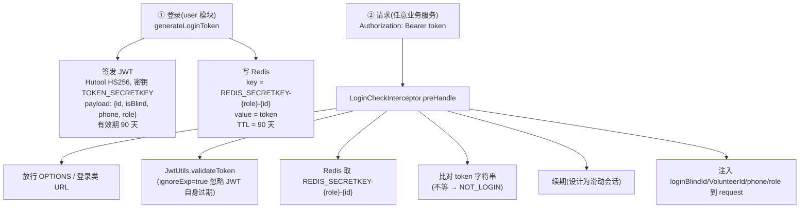

# 鉴权架构

> 跨切面概览：JWT + Redis 单点鉴权链路（架构级流程图）。用户可见契约（FR-AUTH / AC-AUTH）见 [product/current.md](../product/current.md)；风险点与 `file:line` 明细（续期 key 拼接 bug、JWT 过期校验关闭、弱密钥硬编码、MD5 无盐、ai 默认用户后门、WS 绕过鉴权、URL 放行过宽等）见 [shiwujie-backend/docs/known-issues.md](../../shiwujie-backend/docs/known-issues.md)。鉴权工具位于公共层（common-web），但拦截器在每个业务模块各复制一份。

## 总体链路

平台采用 **JWT + Redis 双重校验** 实现单点登录：

**单点原理**：同账号在他处再次登录会**覆盖** Redis 中的 token，旧 token 字符串不再匹配 Redis 值，立即失效。

## 登录与 Token 签发

实现位于 user 模块 `BlindServiceImpl.generateLoginToken` / `VolunteerServiceImpl.generateLoginToken`：

1. 校验手机号格式（`PhoneUtil.isPhone`）、密码格式（`PASSWORD_REGEX`：须含字母+数字、仅字母数字）。
2. 密码 **BCrypt 哈希存储（cost=10，盐内嵌）** 比对；存量无盐 MD5 行登录通过即懒升级（2026-07-12 由 MD5 迁移，见 [known-issues](../../shiwujie-backend/docs/known-issues.md) #6）。
3. 跨表查重：Blind/Volunteer 手机号互斥（同一号只能存在一处）。
4. 构造 payload `{blindId|volunteerId, isBlind, phone, role}` → `JwtUtils.generateToken(payload, TOKEN_SECRETKEY, 90天)`。
5. `redisUtils.setToRedis("REDIS_SECRETKEY-blind-"+id, token, 90L)`（单位=**天**）。

**Redis Token key 规则**：

| 身份 | key | TTL |
|---|---|---|
| 视障者 | `REDIS_SECRETKEY-blind-{blindId}` | 90 天 |
| 志愿者 | `REDIS_SECRETKEY-volunteer-{volunteerId}` | 90 天 |

**关键常量**（`shiwujie-model/.../constants/UserConstants.java`，全模块共享）：

| 常量 | 值 |
|---|---|
| `TOKEN_SECRETKEY` | 固定 HS256 签名密钥（**硬编码、弱**——值与风险见 [known-issues](../../shiwujie-backend/docs/known-issues.md) 风险 #3） |
| `REDIS_SECRETKEY` | 字符串 `"REDIS_SECRETKEY"`（Redis key 前缀） |
| `PASSWORD_REGEX` | `^(?=.*[A-Za-z])(?=.*\d)[A-Za-z0-9]+$` |

## 请求鉴权（LoginCheckInterceptor）

`preHandle` 流程：

1. 放行 OPTIONS（CORS 预检）。
2. URL 含 `loginAndRegister` / `Login` / `Register` 子串 → 放行。
3. 取 `Authorization: Bearer <token>`，缺失抛 `NOT_LOGIN`。
4. `JwtUtils.validateToken(token, TOKEN_SECRETKEY, ignoreExp=true)` —— **第三参恒为 true，即忽略 JWT 自身 exp**，仅校验签名与算法；过期完全交给 Redis。
5. 从 payload 解析 blindId / volunteerId / phone / role。
6. 查 Redis 对应 key，为 null 抛 `NOT_LOGIN`。
7. **比对 token 字符串**（请求 token 必须 == Redis 值）。
8. `renewKey(redisKey, 90L)` 续期（滑动会话，对齐登录 90 天；2026-07-10 修复漏 `-blind-`/`-volunteer-` 前缀 bug，见 [known-issues](../../shiwujie-backend/docs/known-issues.md) #3）。
9. 注入 `loginBlindId` / `loginVolunteerId` / `phone` / `role` 到 `request.setAttribute`。

注销：`/login/logout` 直接删 Redis key。

## 功能需求 / 验收标准 / 已知风险

FR-AUTH / AC-AUTH（含「续期不生效」当前不满足项）见 [../product/v2.1.0/functional-requirements.md](../product/v2.1.0/functional-requirements.md) · [../product/v2.1.0/acceptance-criteria.md](../product/v2.1.0/acceptance-criteria.md)。

风险点 #1–#10（续期 key 拼接 bug、JWT 过期校验关闭、弱密钥硬编码、MD5 无盐、拦截器 4 处复制、ai 默认用户后门、URL 放行过宽、WS 绕过鉴权、社区/家庭审核权限校验不完整、改密接口账户接管）含 `file:line` 明细，统一登记于 [../../shiwujie-backend/docs/known-issues.md](../../shiwujie-backend/docs/known-issues.md)（🔴 项同步进 [../ROADMAP.md](../ROADMAP.md) 安全加固）。其中 **#1 续期 key 拼接 bug 已于 2026-07-10 修复**（滑动会话 90 天生效、删用户清 token 生效）；**#4 MD5 无盐已于 2026-07-12 修复**（改 BCrypt + 存量懒升级）；**#9 社区/家庭审核权限部分修复**（求助帖/社区/社区管理员删改已恢复鉴权，Activity/审核/签到仍待办）；**#10 改密账户接管已于 2026-07-12 修复**（`BlindController`/`VolunteerController` 改密加 ownership 校验——登录人须 == body 目标 id 否则 `NO_AUTH`；service 侧已设密码用户 originPassword 必填且须 `PasswordUtils.matches` 通过，堵住「空原密码绕过」，首次设密免 origin）。

## 改密链路（2026-07-12 加固）

`BlindController.updateBlindPassword` / `VolunteerController.updateVolunteerPassword` 两道闸：

1. **所有权**：从 `LoginUtils.getLoginBlindId/getLoginVolunteerId(request)` 取登录人 id，与请求体 `blindId/volunteerId` 比对，不等即 `NO_AUTH(40030)`「只能修改自己的密码」。
2. **原密码**（仅已设密码用户）：`StrUtil.isBlank(blind.getPassword())` 为真（当前确实无密码，如快注册首登）→ 免原密码、仅校验新密码格式后写入；否则 originPassword 必填，先 `PasswordUtils.matches(originPassword, 存量哈希)`，不匹配即 `PARAMS_ERROR`「原密码输入错误」，通过后写新 BCrypt 哈希。

此前 controller 不校验归属、service 原密码校验整段包在 `if(isNotBlank(originPassword))` 内 → originPassword 留空即跳过 → 任意登录用户可改任意账号密码（账户接管）。修复明细见 [known-issues](../../shiwujie-backend/docs/known-issues.md) 安全漏洞 #9。
