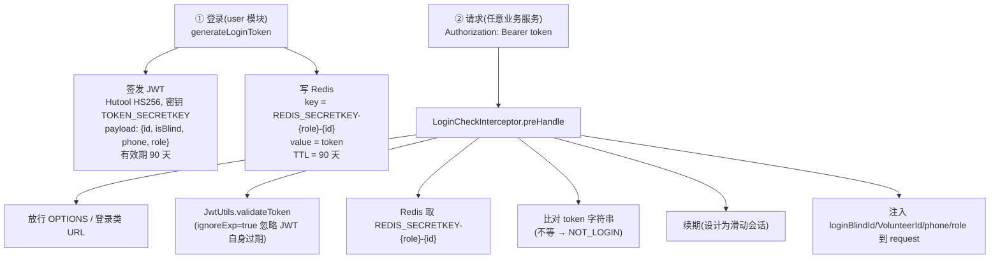

# 鉴权架构

> 本篇描述 JWT + Redis 单点鉴权链路，并**如实记录**其中存在的多个风险点（含一个让「滑动会话静默失效」的 key 拼接 bug）。鉴权工具位于 `shiwujie-common-web`，但拦截器在每个业务模块复制了一份。

## 总体链路

平台采用 **JWT + Redis 双重校验** 实现单点登录：

**单点原理**：同账号在他处再次登录会**覆盖** Redis 中的 token，旧 token 字符串不再匹配 Redis 值，立即失效。

## 登录与 Token 签发

实现位于 user 模块 `BlindServiceImpl.generateLoginToken` / `VolunteerServiceImpl.generateLoginToken`：

1. 校验手机号格式（`PhoneUtil.isPhone`）、密码格式（`PASSWORD_REGEX`：须含字母+数字、仅字母数字）。
2. 密码 **MD5 加密（未加盐）** 存库/比对。
3. 跨表查重：Blind/Volunteer 手机号互斥（同一号只能存在一处）。
4. 构造 payload `{blindId|volunteerId, isBlind, phone, role}` → `JwtUtils.generateToken(payload, "TOKEN_SECRETKEY", 90天)`。
5. `redisUtils.setToRedis("REDIS_SECRETKEY-blind-"+id, token, 90L)`（单位=**天**）。

**Redis Token key 规则**：

| 身份 | key | TTL |
|---|---|---|
| 视障者 | `REDIS_SECRETKEY-blind-{blindId}` | 90 天 |
| 志愿者 | `REDIS_SECRETKEY-volunteer-{volunteerId}` | 90 天 |

**关键常量**（`shiwujie-model/.../constants/UserConstants.java`，全模块共享）：

| 常量 | 值 |
|---|---|
| `TOKEN_SECRETKEY` | 字符串 `"TOKEN_SECRETKEY"`（HS256 签名密钥，**硬编码**） |
| `REDIS_SECRETKEY` | 字符串 `"REDIS_SECRETKEY"`（Redis key 前缀） |
| `PASSWORD_REGEX` | `^(?=.*[A-Za-z])(?=.*\d)[A-Za-z0-9]+$` |

## 请求鉴权（LoginCheckInterceptor）

`preHandle` 流程：

1. 放行 OPTIONS（CORS 预检）。
2. URL 含 `loginAndRegister` / `Login` / `Register` 子串 → 放行。
3. 取 `Authorization: Bearer <token>`，缺失抛 `NOT_LOGIN`。
4. `JwtUtils.validateToken(token, TOKEN_SECRETKEY, ignoreExp=true)` —— **第三参恒为 true，即忽略 JWT 自身 exp**，仅校验签名与算法；过期完全交给 Redis。
5. 从 payload 解析 blindId / volunteerId / phone / role。
6. 查 Redis 对应 key，为 null 抛 `NOT_LOGIN`。
7. **比对 token 字符串**（请求 token 必须 == Redis 值）。
8. `renewKey(..., 1L)` 续期（单位=天，见下文风险）。
9. 注入 `loginBlindId` / `loginVolunteerId` / `phone` / `role` 到 `request.setAttribute`。

注销：`/login/logout` 直接删 Redis key。

## 功能需求（FR-AUTH）

- **FR-AUTH-01**：登录成功后须生成 HS256 JWT 并写 Redis（TTL=90 天）。
- **FR-AUTH-02**：每个受保护服务须校验 Bearer token：JWT 签名 + Redis token 比对，**忽略 JWT 自身 exp，以 Redis TTL 为准**。
- **FR-AUTH-03**：须放行 OPTIONS 预检与登录/注册类 URL。
- **FR-AUTH-04**：校验通过后须注入用户身份到请求属性。
- **FR-AUTH-05**：每次合法请求须对 Redis token key 续期（设计意图=滑动会话）。
- **FR-AUTH-06**：注销须删除 Redis 中对应 token key。

## 验收标准（AC-AUTH）

- **AC-AUTH-01**：登录返回的 token 可用于受保护接口（200 + 业务数据）。
- **AC-AUTH-02**：删除 Redis 对应 key 后，同 token 再请求返回 40010 NOT_LOGIN。
- **AC-AUTH-03**：篡改 token 签名 → NOT_LOGIN（HS256 校验生效）。
- **AC-AUTH-04**：JWT 过期但 Redis key 仍存在时，请求**仍成功**（ignoreExp=true）。
- **AC-AUTH-05**：⚠ **当前不满足**——合法请求后 Redis token key 的 TTL 未被刷新（见风险 #1 续期 key bug）。

## 已知问题与风险点

> 以下为审计如实记录，多数源自「拦截器在 4 个模块复制粘贴」与早期快速开发，建议后续治理。

### 🔴 风险 #1：续期 key 拼接 bug（滑动会话静默失效）

`renewKey` / `expire` 调用拼的 key **少了 `-blind-` / `-volunteer-` 段**：

| 操作 | key 拼接 | 是否正确 |
|---|---|---|
| 登录存（BlindServiceImpl:458） | `REDIS_SECRETKEY-blind-{id}` | ✅ |
| 注销删（BlindController:114 logout） | `REDIS_SECRETKEY-blind-{id}` | ✅ |
| 拦截器读（LoginCheckInterceptor:89） | `REDIS_SECRETKEY-blind-{id}` | ✅ |
| **拦截器续期（LoginCheckInterceptor:98 / ai:87）** | `REDIS_SECRETKEY-{id}` | ❌ **漏前缀** |
| 删用户（BlindController:143 deleteBlind） | `REDIS_SECRETKEY-{id}` | ❌ 漏前缀 |

**后果**：续期作用在**不存在的 key** 上，Redis 静默忽略 → **滑动会话实际不生效**。token 一旦写入即按 90 天硬过期，活跃用户也会在 90 天后被踢下线；删用户删 token 同样漏前缀（注销 logout 是对的）。`renewKey(..., 1L)` 的单位经查为 **`TimeUnit.DAYS`（1 天）**（`RedisUtils.renewKey` → `redisTemplate.expire(key, t, TimeUnit.DAYS)`）。

> 单位（疑点 #5）已定论：**天**，注释「续期 24 小时」与代码一致。

### 🔴 风险 #2：JWT 过期校验被关闭

`validateToken(..., true)` 第三参 `ignoreExp=true`，JWT 自身 exp **永不生效**，过期完全依赖 Redis TTL。一旦 Redis 故障/误写，JWT 形同永久有效。

### 🔴 风险 #3：TOKEN_SECRETKEY 硬编码且弱

密钥即字符串 `"TOKEN_SECRETKEY"`，明文出现在共享 model 模块，HS256 弱密钥有被离线爆破/伪造 token 风险。

### 🔴 风险 #4：MD5 存密码、无加盐

`SecureUtil.md5(password)`，MD5 不适用于口令存储且无 salt → 彩虹表攻击风险。建议 BCrypt/Argon2。

### 🟠 风险 #5：LoginCheckInterceptor 4 处复制 + 行为分叉

`{user, call, community, ai}/.../interceptor/LoginCheckInterceptor.java` 各一份：

- user/call/community 三份**几乎逐字相同**（仅 URL 放行规则略有差异）。
- **ai 那份完全不同**：jakarta 命名空间、直调 RedisTemplate、`@DubboReference InnerBlindService` 拉 Blind 实体，且**无 token 时 fallback 到测试用户 blindId=1**（生产后门，见下）。

> 应抽到 common-web 统一份，但被 SB2/SB3 割裂阻挡（common-web 是 SB2.7，ai 用不了 `javax.*`）。

### 🔴 风险 #6：ai 模块默认用户兜底（生产后门）

ai 的 `LoginCheckInterceptor` 在无 Authorization 时注入 blindId=1 / phone=19872250169 作为默认用户（开发期便利）。**生产若未关闭，任何人可白嫖 AI 接口**（消耗 DashScope token）。

### 🟠 风险 #7：URL 放行规则过宽

`url.contains("loginAndRegister")` / `contains("Login")` 按子串放行，未限定 path。任何含该子串的路径都会绕过鉴权。建议改 AntPathMatcher 精确匹配。

### 🟠 风险 #8：/ws/call 未在鉴权放行白名单

`WebConfig` 的 `excludePathPatterns` 不含 `/ws/call`。Spring MVC 拦截器不拦截 WS 升级请求，`@ServerEndpoint` 走独立容器 → **WS 实际绕过 JWT 校验**。任何人构造 `{requestType:0, volunteerPhone:"任意号"}` 即可冒名 bind，接收他人求助通知。建议在 bind 阶段校验 token。

### 🟠 风险 #9：社区/家庭审核权限校验不完整

- `FamilyJoinReviewServiceImpl.updateFamilyJoinReview` 仅比对 `reviewerId == loginVolunteerId`，但 reviewerId 来自前端入参且**未校验登录人是否为该家庭的 creator** → 理论上任一志愿者可审核他人家庭。
- community 的 `deleteCommunity` / `updateCommunity` 注释「只有注册人可以修改」但**实现未校验**；`HelppostServiceImpl` 的删除/更新权限检查**整段被注释**（任何登录视障者可删任意帖）。
- 详见 [`../backend/user.md`](../backend/user.md) 与 [`../backend/community.md`](../backend/community.md) 的「已知问题」。
