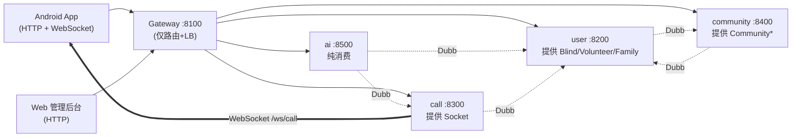
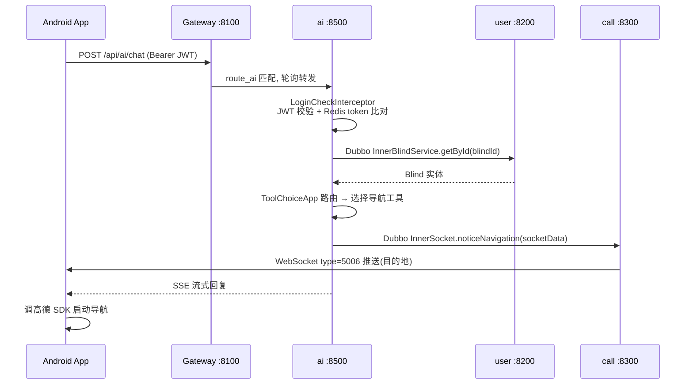

# 网关路由与 Dubbo 调用

> 跨切面概览：网关路由表、Dubbo 接口契约清单（跨服务「单一真相源」）、RPC 调用图与时序图。用户可见契约（FR-GATEWAY / FR-MODEL / AC-GATEWAY / AC-MODEL）见 [product/current.md](../product/current.md)；启动命令与生产 Dubbo 注册 IP 坑见 [shiwujie-backend/docs/deployment.md](../../shiwujie-backend/docs/deployment.md)。

## 网关路由表

网关（`shiwujie-gateway`，端口 **8100**，Spring Cloud Gateway）**仅做路由与负载均衡，不做鉴权**。鉴权下沉到各业务服务的 `LoginCheckInterceptor`（详见 [`auth.md`](auth.md)）。

| 路由 id | 谓词 Path | URI | 转发目标 | 端口 |
|---|---|---|---|---|
| `route_user` | `/api/user/**` | `lb://shiwujieUser` | user 服务 | 8200 |
| `route_call` | `/api/call/**` | `lb://shiwujieCall` | call 服务 | 8300 |
| `websocket_sockjs_route` | `/api/ws/call` | `lb://shiwujieCall` | call（SockJS） | 8300 |
| `websocket_route` | `/api/ws/call` | `lb:ws://shiwujieCall` | call（原生 WS） | 8300 |
| `route_community` | `/api/community/**` | `lb://shiwujieCommunity` | community 服务 | 8400 |
| `route_ai` | `/api/ai/**` | `lb://shiwujieAi` | ai 服务 | 8500 |

- `lb://` = Spring Cloud LoadBalancer，轮询策略。
- Knife4j 4.4.0 手动聚合 user/call/community 的 Swagger（**未聚合 ai**——ai 是 SB3/OpenAPI3，与 SB2 的 v2 api-docs 不兼容）。
- WebSocket 走 `lb:ws://` 双形态（原生 + SockJS），承接视频求助实时连接。

## 各服务端口与基础设施

| 模块 | HTTP | context-path | Dubbo 端口 | MySQL 库 | Redis db |
|---|---|---|---|---|---|
| gateway | 8100 | `/` | — | — | — |
| user | 8200 | `/api/user` | 21200 | shiwujieuser | 2 |
| call | 8300 | `/api` | 21300 | shiwujiecall | 2 |
| community | 8400 | `/api/community` | 21400 | shiwujiecommunity | 2 |
| ai | 8500 | （未设） | 21500 | shiwujieai | 2 |

## Dubbo 接口契约清单（单一真相源）

> 全部接口定义集中在 `shiwujie-model/src/main/java/com/swj/shiwujie/service/{user,call,community}/Inner*.java`。实现标 `@DubboService`，消费方标 `@DubboReference`。**接口即契约**：签名变更会让所有提供者/消费者编译期同步报错。

| # | 接口 | 提供者 | 主要方法 | 已知消费者 |
|---|---|---|---|---|
| 1 | `InnerBlindService` | **user** | getById / getByPhone / updateById / removeCommunityId | call, community, ai |
| 2 | `InnerVolunteerService` | **user** | getById / save / updateById / getByPhone / getListByFamilyId / generateLoginToken / getVolunteerVO / removeCommunityId | call, community |
| 3 | `InnerFamilyService` | **user** | getFamilyVOById / joinFamily / userLeaveFromFamily | **ai** |
| 4 | `InnerSocket` | **call** | noticeTakePhoto / noticeVideoHelp / noticeUrgentHelp / noticeJumpSoftware / noticeJumpToUserUpdate / noticeNavigation（6 类前端推送） | **ai** |
| 5 | `InnerCommunityService` | **community** | getById / deleteCommunity | user |
| 6 | `InnerCommunityjoinreviewService` | **community** | save / getById / getOne | user |
| 7 | `InnerCommunitymanagerService` | **community** | getCountByVolunteerIdAndCommunityId / getByVolunteerIdAndCommunityId / removeByVolunteerIdAndCommunityId | user |
| 8 | `InnerActivityService` | **community** | getActivityVOById / listActivitiesByCommunity / listActivities | **无消费者**（冗余/预留） |
| 9 | `InnerActivitysignService` | **community** | addActivitySign / listActivitySignByActivity | **无消费者** |
| 10 | `InnerHelppostService` | **community** | addHelppost / listQueryHelpposts / deleteHelppost / updateHelppost | **无消费者** |

> community 的 `InnerActivityService` / `InnerActivitysignService` / `InnerHelppostService` 已 `@DubboService` 暴露但**全局无 `@DubboReference` 消费方**——属预留契约或清理遗漏（社区功能当前在 community 模块内本地调用）。

## Dubbo 调用图

**调用关系（无环，业务可解耦）**：

- `ai → user`（Blind、Family）、`ai → call`（Socket，AI→前端推送的唯一落地点）
- `call → user`（Blind、Volunteer）
- `community → user`（Blind、Volunteer）
- `user → community`（Community、Communityjoinreview、Communitymanager）

> `user ↔ community` 看似互调，但 user 调的是 community 的查询/审核接口、community 调的是 user 的查询接口，业务上可解耦。

## 一次端到端调用（AI 触发导航，跨 3 服务）

---

> **延伸阅读**
>
> - 用户可见契约（FR-GATEWAY / FR-MODEL / AC-GATEWAY / AC-MODEL）：[../product/v2.1.0/functional-requirements.md](../product/v2.1.0/functional-requirements.md) · [../product/v2.1.0/acceptance-criteria.md](../product/v2.1.0/acceptance-criteria.md)
> - 各微服务技术实现（核心类 / 数据流 / 配置）：[../../shiwujie-backend/docs/modules/](../../shiwujie-backend/docs/modules/)
> - 启动命令、生产 Dubbo 注册 IP 坑（两条独立注册链路）、端口可达性、Docker：[../../shiwujie-backend/docs/deployment.md](../../shiwujie-backend/docs/deployment.md)
> - 冗余 Inner 契约（Activity/Activitysign/Helppost 无消费者）：[../../shiwujie-backend/docs/known-issues.md](../../shiwujie-backend/docs/known-issues.md)
