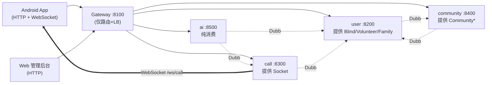
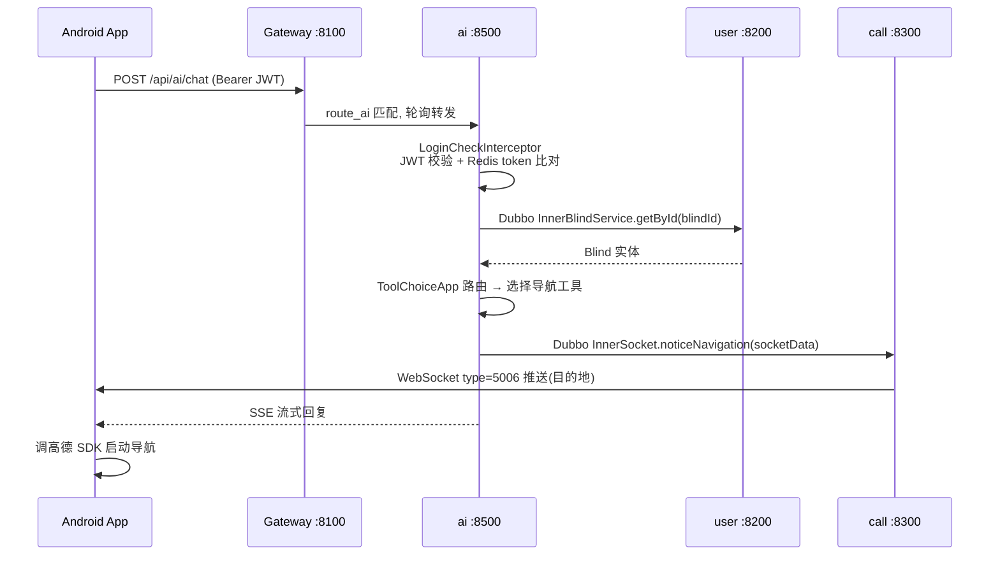

# 网关路由与 Dubbo 调用

> 本篇定义网关路由表、Dubbo 接口契约清单（跨服务「单一真相源」）与 RPC 调用图，并记录生产环境的 Dubbo 注册 IP 坑。

## 网关路由表

网关（`shiwujie-gateway`，端口 **8100**，Spring Cloud Gateway）**仅做路由与负载均衡，不做鉴权**。鉴权下沉到各业务服务的 `LoginCheckInterceptor`（详见 [`auth.md`](auth.md)）。

| 路由 id | 谓词 Path | URI | 转发目标 | 端口 |
|---|---|---|---|---|
| `route_user` | `/api/user/**` | `lb://shiwujieUser` | user 服务 | 8200 |
| `route_call` | `/api/call/**` | `lb://shiwujieCall` | call 服务 | 8300 |
| `websocket_sockjs_route` | `/api/ws/call` | `lb://shiwujieCall` | call（SockJS） | 8300 |
| `websocket_route` | `/api/ws/call` | `lb:ws://shiwujieCall` | call（原生 WS） | 8300 |
| `route_community` | `/api/community/**` | `lb://shiwujieCommunity` | community 服务 | 8400 |
| `route_ai` | `/api/ai/**` | `lb://shiwujieAi` | ai 服务 | 8500 |

- `lb://` = Spring Cloud LoadBalancer，轮询策略。
- Knife4j 4.4.0 手动聚合 user/call/community 的 Swagger（**未聚合 ai**——ai 是 SB3/OpenAPI3，与 SB2 的 v2 api-docs 不兼容）。
- WebSocket 走 `lb:ws://` 双形态（原生 + SockJS），承接视频求助实时连接。

## 各服务端口与基础设施

| 模块 | HTTP | context-path | Dubbo 端口 | MySQL 库 | Redis db |
|---|---|---|---|---|---|
| gateway | 8100 | `/` | — | — | — |
| user | 8200 | `/api/user` | 50200 | shiwujieuser | 2 |
| call | 8300 | `/api` | 50300 | shiwujiecall | 2 |
| community | 8400 | `/api/community` | 50400 | shiwujiecommunity | 2 |
| ai | 8500 | （未设） | 50500 | shiwujieai | 2 |

## Dubbo 接口契约清单（单一真相源）

> 全部接口定义集中在 `shiwujie-model/src/main/java/com/swj/shiwujie/service/{user,call,community}/Inner*.java`。实现标 `@DubboService`，消费方标 `@DubboReference`。**接口即契约**：签名变更会让所有提供者/消费者编译期同步报错。

| # | 接口 | 提供者 | 主要方法 | 已知消费者 |
|---|---|---|---|---|
| 1 | `InnerBlindService` | **user** | getById / getByPhone / updateById / removeCommunityId | call, community, ai |
| 2 | `InnerVolunteerService` | **user** | getById / save / updateById / getByPhone / getListByFamilyId / generateLoginToken / getVolunteerVO / removeCommunityId | call, community |
| 3 | `InnerFamilyService` | **user** | getFamilyVOById / joinFamily / userLeaveFromFamily | **ai** |
| 4 | `InnerSocket` | **call** | noticeTakePhoto / noticeVideoHelp / noticeUrgentHelp / noticeJumpSoftware / noticeJumpToUserUpdate / noticeNavigation（6 类前端推送） | **ai** |
| 5 | `InnerCommunityService` | **community** | getById / deleteCommunity | user |
| 6 | `InnerCommunityjoinreviewService` | **community** | save / getById / getOne | user |
| 7 | `InnerCommunitymanagerService` | **community** | getCountByVolunteerIdAndCommunityId / getByVolunteerIdAndCommunityId / removeByVolunteerIdAndCommunityId | user |
| 8 | `InnerActivityService` | **community** | getActivityVOById / listActivitiesByCommunity / listActivities | **无消费者**（冗余/预留） |
| 9 | `InnerActivitysignService` | **community** | addActivitySign / listActivitySignByActivity | **无消费者** |
| 10 | `InnerHelppostService` | **community** | addHelppost / listQueryHelpposts / deleteHelppost / updateHelppost | **无消费者** |

> community 的 `InnerActivityService` / `InnerActivitysignService` / `InnerHelppostService` 已 `@DubboService` 暴露但**全局无 `@DubboReference` 消费方**——属预留契约或清理遗漏（社区功能当前在 community 模块内本地调用）。

## Dubbo 调用图



**调用关系（无环，业务可解耦）**：

- `ai → user`（Blind、Family）、`ai → call`（Socket，AI→前端推送的唯一落地点）
- `call → user`（Blind、Volunteer）
- `community → user`（Blind、Volunteer）
- `user → community`（Community、Communityjoinreview、Communitymanager）

> `user ↔ community` 看似互调，但 user 调的是 community 的查询/审核接口、community 调的是 user 的查询接口，业务上可解耦。

## 一次端到端调用（AI 触发导航，跨 3 服务）



## 生产部署：Dubbo 注册 127.0.0.1 坑（两条独立注册链路）

**问题**：服务部署到服务器后，注册到 Nacos 的地址默认是本机网卡地址（常为 `127.0.0.1`），导致跨机调用失败。

**根因——本项目存在两条独立的 Nacos 注册链路，IP 由不同机制控制**：

| 注册链路 | 用途 | IP 控制方式 |
|---|---|---|
| Spring Cloud Nacos Discovery | 网关 `lb://` 路由发现服务实例 | `spring.cloud.nacos.discovery.ip`（dev/prod profile） |
| Dubbo Registry（`dubbo.registry.address: nacos://...`） | Dubbo RPC 消费者发现提供者 | **`-DDUBBO_IP_TO_REGISTRY`（启动命令 JVM 参数）**——yml 中无任何 Dubbo IP 配置 |

> ⚠ **关键**：Dubbo 经 `dubbo.registry.address` **独立**注册到 Nacos，**不复用** Spring Cloud 的 `discovery.ip`。因此 `spring.cloud.nacos.discovery.ip` 只修正网关 `lb://` 的实例 IP，**对 Dubbo 注册地址无效**。实测部署时仅配 `discovery.ip`，Dubbo 仍注册 `127.0.0.1`、消费者无法 RPC；**生产必须在启动命令加 `-DDUBBO_IP_TO_REGISTRY=<公网IP>`。**

**生产启动命令（实测，两个参数都要）**——user/call/community/ai 四服务同构，仅 jar 名不同：

```bash
java -Xms128m -Xmx256m -XX:MetaspaceSize=64m -XX:MaxMetaspaceSize=128m \
  -DDUBBO_IP_TO_REGISTRY=47.112.114.139 \
  -jar /home/liu/shiwujie/shiwujieUser-0.0.1-SNAPSHOT.jar \
  --spring.profiles.active=prod \
  --spring.cloud.nacos.discovery.ip=47.112.114.139
```

> `--spring.cloud.nacos.discovery.ip` 与 prod profile 内的值一致（命令行再传一次为双保险）。

**关于多环境重构（commit `2e5573a`）**：重构只调整了 `spring.cloud.nacos.discovery.ip`（移入 profile）与凭据占位符化，**未改动 Dubbo 注册机制**（Dubbo 从未在 yml 配置注册 IP，重构前后皆然）。故 `-DDUBBO_IP_TO_REGISTRY` 的必要性是**结构性的**（Dubbo 独立注册），**并非多环境重构引入的回归**。

**残留风险**：`${nacos.address:47.112.114.139}` 把生产 IP 硬编码进代码库默认值；新服务器部署需**同时**改 prod yml 的 `discovery.ip` 与启动命令的 `DUBBO_IP_TO_REGISTRY`。

## 功能需求（FR）

- **FR-GATEWAY-01**：网关须基于 Nacos 服务发现对 user/call/community/ai 做路径前缀路由。
- **FR-GATEWAY-02**：网关须支持 WebSocket 与 SockJS 双形态路由（`lb:ws://`）。
- **FR-GATEWAY-03**：网关须通过 Knife4j 聚合各服务 Swagger（当前未聚合 ai）。
- **FR-GATEWAY-04**：网关须提供轮询负载均衡（Spring Cloud LoadBalancer）。
- **FR-GATEWAY-05**：网关须能在多机部署时正确注册对外可达 IP（dev/prod profile）。
- **FR-MODEL-01**：所有跨服务 RPC 接口须集中在 shiwujie-model 定义（`Inner*Service`）。
- **FR-MODEL-02**：domain / enums / request / VO 须在 shiwujie-model 统一维护作为数据契约。

## 验收标准（AC）

- **AC-GATEWAY-01**：`curl http://<gateway>:8100/api/user/...` 经路由可达 user:8200。
- **AC-GATEWAY-02**：建立 WebSocket 到 `/api/ws/call` 握手成功并保持长连接。
- **AC-GATEWAY-03**：访问 `/doc.html` 能看到聚合的 user/call/community 接口文档。
- **AC-GATEWAY-04**：停掉某服务实例后 LoadBalancer 不再路由到该实例。
- **AC-GATEWAY-05**：`-Dspring.profiles.active=prod` 启动后 Nacos 控制台注册 IP=47.112.114.139。
- **AC-MODEL-01**：shiwujie-model 可独立 `mvn install`，被其余模块依赖。
- **AC-MODEL-02**：Inner*Service 签名变更后，编译期所有提供者/消费者同步报错。
