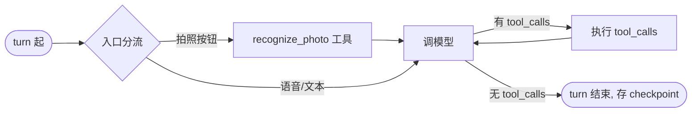

# AI 智能体设计圣经（自建 ReAct loop · langchain-core）

> **实现载体（2026-07-18 终定）**：**自建 ReAct loop**——langchain-core 地基（`ChatModel` / `@tool` / `Message`）+ 手写 `while` loop + 复用 langchain 生态（`langchain-mcp-adapters` / LangSmith）。**不引 LangGraph**：v1 复杂度（标准 ReAct 环 + 自然 turn HITL，无 `interrupt` / 子图 / 状态机）用不上 graph 原语；逐原语核对见下文——除 checkpoint 外全部手写不亏（条件边一行 / ToolNode 十行 / interrupt 本就没用），而 checkpoint 在盲人对话（状态 = 一个 message list）下手写风险低。自建 loop **朝 Pi 金标准契约造**（⑫），学得更深、更可控（prod 出事能直接读代码）。LangGraph 留作撞墙（真需 `interrupt` / 多 agent / 复杂 checkpoint 一致性）时的升级路径，**不预支**；手写 checkpoint 可作 LangGraph 接入前的过渡。下文原 "State / 节点 / 边 / checkpointer" 术语已换 "上下文 / loop 阶段 / while 结构 / 手写 checkpoint" 语境，**设计骨架（工具 / skill / KB / 两层记忆 / HITL / 红队硬修正）全不变**。
>
> AI 重写的**最详细技术文档**：自建 ReAct loop 智能体的 对话上下文 / loop 阶段 / HITL / checkpoint / 动态反馈 / 工具集 / skill / KB / 两层记忆 / 诚实选型 / Pi 金标准契约 / 硬修正全列。development 层（允许全部技术词与设计符号）。**状态：设计敲定（Phase 1–4）· 实现待 Phase 5**——下文为已敲定设计，非已运行代码。用户契约在根 [product/current.md](../../docs/product/current.md)；polyglot 总图在根 [architecture/ai-rewrite.md](../../docs/architecture/ai-rewrite.md)。

---

## ① 对话上下文（loop 间传递的状态）

自建 loop 不用框架级 State 对象，但需要一个**上下文字典**在 turn 内循环与 turn 间 checkpoint 间传递。本质就是一个 Python 对象，核心是 `messages` 列表：

| 字段 | 类型 | 说明 |
|---|---|---|
| `messages` | `list[BaseMessage]` | 对话历史，loop 内**只追加**（system / user / assistant / tool 四类）。turn 结束整体存 checkpoint，下轮载回续跑。 |
| `blind_id` | `str` | 会话标识 = 记忆 key = checkpoint key（`ai:ckpt:{blind_id}`）。由 Java 鉴权后经缝 A 内部 HTTP header 传入，Python **从不**信任客户端自报。 |
| `position` | `dict{lat,lng,address} \| None` | **每轮**位置快照。App 在每个 turn 注入当前位置（盲人位置可能漂移）；loop 起步注入 system prompt（供 get_weather / gaode_poi_search / gaode_route 用）。位置**逐轮刷新、不跨轮累积**（只看当前轮）。 |
| `available_skills` | `list[str]` | 可加载技能名清单（v1 = `["navigation"]`），注入 system prompt 供 loop 判断是否 `read_skill`。 |
| `issuing_turn` | `str \| None` | 紧急求助 token 发行轮次（见 ⑬ 硬修正 1）：confirm 工具拒绝**同轮** token 的判据。 |

`blind_id` / `issuing_turn` 入口写入后基本只读；`position` 每个 turn 起步刷新。无 reducer 概念——loop 内直接 `messages.append(...)`，turn 结束 `save_checkpoint(blind_id, ctx)`。

## ② loop 三个阶段

### 阶段 1：入口分流（确定性 fork，非 LLM）

纯路由逻辑，按 turn 的**入口形态**确定性分流（不走模型，零 token 成本）：

| 入口形态 | 路由 | 说明 |
|---|---|---|
| 拍照按钮 | 直连 `recognize_photo` 工具（绕过 loop） | 盲人单点拍照意图明确，无需 LLM 判意。但 VLM 结果**写回 `messages`**（作为 ToolMessage），下一轮 loop 能看到该描述、可继续追问。 |
| 语音 / 文本 | 注 `position`（若有）入上下文，进入 loop | 位置写进 system prompt 段（见下），再走标准 ReAct loop。 |

> 之所以拍照绕 loop：省一次 LLM 调用 + 避免误判；但结果必须回灌 `messages`——否则 loop 失去对该轮的上下文。这是「绕 loop 不绕上下文」。

### 阶段 2：调模型（loop 主体）

绑定 **14 工具 + read_skill**（见 ⑦），system prompt 由三段拼装：

1. **角色与可用工具说明**：盲人 AI 助手定位 + 当前轮可用工具清单（含 native 与经 MCP 接入的 Java 工具，LLM **不感知来源差异**——见 ⑦）。
2. **位置说明**：当前轮 `position`（若有）以自然语言注入（如「用户当前在 lat=30.57,lng=104.07，约成都市」），供 get_weather / gaode_poi_search / gaode_route / launch_navigation 解释坐标。
3. **few-shot**：少量期望行为样例（含导航分步确认、紧急求助先问确认、偏好应记住但勿强加）。

调用模型用**原生 function-calling**（Decision A）：把 14 工具 + read_skill 以 OpenAI 兼容 tools schema 喂给 qwen，模型原生返回 `tool_calls`——「意图识别 + 工具选择」一步完成，**杀掉旧工作流式 prompt-as-router 的 2-call 税**（旧路由先 LLM 判意图、再 LLM 生成回复）。依赖 qwen FC 稳，spike 前置（见 ⑬ 硬修正 3）。

**失败 encode 不抛**（Pi 金标准）：loop 捕获模型层异常（网络 / 超时 / schema 违例），**encode 成一条「系统出错」的 AIMessage 写回 `messages`** 返回，而非抛异常终止 loop。理由：用户应听到「我这边出了点问题，再说一次好吗」而不是连接中断；loop 终止等于 session 死掉，checkpoint 也救不回当前 turn。

### 阶段 3：执行 tool_calls

loop 遍历模型返回的 `tool_calls`，把每个工具返回值包成 `ToolMessage` 追加回 `messages`。承载 14 工具 + read_skill（见 ⑦）。工具失败的 encode 见 ⑫「工具失败 = isError observation 回灌自愈」。

## ③ while loop（标准 ReAct 环）



turn 内核心是一个 `while` 循环：`调模型 → 模型返回 tool_calls? → 执行 → 再调模型 → ... → 无 tool_calls → turn 结束`。等价伪代码（设计 ⑫ 契约落在各行注释处，chunk-2a 以此为 source of truth）：

```python
ctx = load_checkpoint(blind_id)              # ⑤ 手写 checkpoint 载回
ctx.messages.append(HumanMessage(text))      # 阶段1 入口分流：语音/文本入 loop
while True:
    try:
        ai = await model.astream(ctx.messages, tools=toolset)  # 阶段2 ⑥动态反馈
    except Exception as e:
        ctx.messages.append(encode_error(e)) # ⑫ 失败 encode 不抛
        break
    ctx.messages.append(ai)
    if not ai.tool_calls: break              # 无 tool_calls → turn 结束
    for tc in ai.tool_calls:                 # 阶段3 执行 tool_calls
        result = await tool_map[tc["name"]].ainvoke(tc["args"])  # ⑫ isError 回灌
        ctx.messages.append(ToolMessage(result, tool_call_id=tc["id"]))
    if should_stop_after_turn(ctx): break    # ⑫ 成本轮次熔断
save_checkpoint(blind_id, ctx)               # ⑤ turn 结束存回
```

无子图、无状态机（navigation skill 见 ⑧ 用 checkpoint 串多轮，但本身仍是这个标准 loop，不是独立子图）。条件边判定 = 模型返回的 AIMessage 是否含 `tool_calls`，在自建 loop 里就是 `if not ai.tool_calls: break` 一行——这正是「条件边一行、手写不亏」。

## ④ HITL（Human-In-The-Loop，两处）

v1 **两处需用户确认的场景都用「自然 turn + 手写 checkpoint」**实现（自建 loop 本就没有 `interrupt()` 原语，turn 边界停就是天然暂停点）：

| 场景 | 实现 |
|---|---|
| 导航分步确认（问交通方式） | navigation skill 6 步流程（见 ⑧）中第 3 步「问交通方式」= LLM 先问、然后 **END**，等用户下轮语音答；checkpoint 持久化中间状态，下轮 agent 读 messages 续第 4 步。多轮串接靠 checkpoint，**不靠 interrupt**。 |
| 紧急求助确认门 | LLM 识别到紧急求助意图 → 先问「确认要呼叫紧急联系人吗？」→ **END** → 用户下轮确认后，agent 才调 `request_emergency_help`（见 ⑬ 硬修正 1：拆 prepare/confirm + parallel_tool_calls=False）。 |

> 之所以 v1 不用 `interrupt()`：① 自然 turn 在盲人语音场景更自然（用户说完一句、系统问一句、用户再说一句）；② checkpoint 已能跨轮恢复，interrupt 的「同 turn 内暂停」能力 v1 用不到。**保留 `interrupt()` 作未来 turn 内强暂停**（如长任务中途插入用户决策、非紧急的强制确认）。

## ⑤ 手写 checkpoint（崩溃 / 中途截止恢复）

```text
短期记忆 = 手写 checkpoint（Redis 存整个上下文对象）
  存储 = Redis db=2
  key  = ai:ckpt:{blind_id}        ← blind_id 作 key（等价 LangGraph 的 thread_id）
  内容 = 全量 messages + 滚动 summary（见 ⑩）+ issuing_turn 等元字段
  作用 = 崩溃 / 进程重启 / 用户中途截止后继续，loop 从上次状态续跑
```

手写 checkpoint = turn 结束把整个上下文（messages list + 元字段）序列化（json / pickle）存 Redis，下轮 turn 起 `load_checkpoint(blind_id)` 载回续跑。状态简单（一个 message list），手写无一致性风险——这是「checkpoint 在盲人对话下手写不亏」的根因。`ai:ckpt:` 前缀**刻意**与 Java 侧 Redis key（spring-session / JWT `REDIS_SECRETKEY-*`）隔离，避免双进程误读误写。盲人换设备 / App 重启后仍可按 blind_id 续上对话。

> **何时该升级 LangGraph checkpoint**：若未来需要 turn 内步级快照（每调一次工具存一次可回滚）、多分支 session 树、或跨实例一致 checkpoint——手写会变复杂，那时引 LangGraph 的 per-node checkpointer 值。v1 的「turn 级」粒度不需要。

## ⑥ 动态反馈（流式进度事件）

loop 运行中用 **`model.astream()` + 手写进度事件**：调模型走 `astream` 拿逐 token 流（token 流即进度），工具进入 / loop 起调等处手写 yield 进度事件，经缝 A 内部 HTTP（FastAPI StreamingResponse）回灌 Java，Java 再经 WS 推给 App。自建 loop 的优势：进度事件就在 `while` 循环里手写 yield，无需框架的 `stream_mode` 抽象（事件即代码，可见可控）。

| 进度事件 | 触发点 | 用户感知 |
|---|---|---|
| `thinking`（思考中） | loop 起调模型 | 「让我想想…」 |
| `searching`（搜索中） | web_search / gaode_poi_search / search_kb 进入 | 「我在查…」 |
| `recognizing_photo`（拍照中） | recognize_photo 进入 | 「正在看照片…」 |
| `routing`（算路线中） | gaode_route 进入 | 「正在算路线…」 |
| token 流（逐字） | `model.astream()` 返回 | 打字机效果 + 流式 TTS |

**6 信令码（5001–5006）的动作信令**（如 launch_navigation 触发 5006）由**对应工具自发副作用**发出（工具执行成功时经缝 A 通知 Java 发对应信令），不走进度事件通道——动作信令是「命令 App 做事」，进度事件是「告诉用户我在想/查」，两通道分离。

## ⑦ 14 工具清单 + 来源

LLM 看到的 toolset 是**统一的 15 项**（14 工具 + read_skill）——**canonical 计数**；紧急求助拆 `prepare()` / `confirm()` 双工具（见 ⑬ 硬修正 1）后**实际 FC-facing 暴露 16 项**（15 工具 + read_skill）。下表按 canonical 14 列（emergency 单行、拆分细节见 ⑬）。来源分三类，LLM **不感知**来源差异（经 `MultiServerMCPClient.get_tools()` 把 MCP 工具并入 toolset，与 native StructuredTool 同形）：

| 来源 | 工具 | 说明 |
|---|---|---|
| **Python-native（6）** | `recognize_photo(question?)` | VLM 图片理解，question 可选聚焦 |
| | `web_search` | 通用网络搜索 |
| | `get_weather` | 用**当前轮 position** 取天气 |
| | `gaode_poi_search` | 高德 POI 搜索（决策类，直调高德 web API，出参剪裁朗读友好） |
| | `gaode_route` | 高德路线规划（决策类，同上） |
| | `search_kb` | BM25 功能 KB 检索（返回整篇，见 ⑨） |
| **元工具（1）** | `read_skill(name)` | 技能文档加载器（Pi 式 read-on-demand），加载 SKILL.md body 注入 messages 供 agent 后续步用 |
| **Java-MCP（8，经缝 C）** | `join_family` / `leave_family` / `family_info` | 业务：家庭关系管理 |
| | `update_profile`（**仅基本字段**：nickname/phone/gender） | 业务：资料更新（敏感字段门见 ⑬ 硬修正 2） |
| | `launch_navigation`（5006） | 信令：起导航 UI（App 高德 SDK） |
| | `request_video_help`（5002） | 信令：请求视频协助 |
| | `request_emergency_help`（5003） | 信令：请求紧急求助（拆 prepare/confirm，见 ⑬ 硬修正 1） |
| | `open_app`（5004，白名单） | 信令：打开指定 App |

**高德接入分工**：决策类（poi / route / weather）= 后端 Python 自建 3 个 REST wrapper tool（直调高德 web API，**出参剪裁**为盲人朗读友好；不接高德官方 MCP——其出参不可控、进程不经济）。执行类（起导航 UI）= App 高德 SDK（`launch_navigation` → 5006）。**反转条件**：高德能力涨到 8–10+ 工具再引官方 MCP。

## ⑧ navigation skill（read-on-demand，6 步）

navigation 是 v1 唯一技能，`read_skill("navigation")` 加载 `SKILL.md` body（非子图、非状态机）注入 messages，agent 按 body 描述执行 6 步：

```text
1. poi    —— gaode_poi_search 找候选终点
2. 报选项 —— 把候选朗读给用户
3. 问交通方式 —— HITL：问「走路 / 公交 / 开车？」然后 END，等下轮答（checkpoint 串多轮）
4. route  —— gaode_route 算路线
5. 朗读摘要 —— 把路线摘要（距离 / 时长 / 关键转弯）朗读
6. launch —— launch_navigation（5006）起 App 导航 UI
```

**无子图、无状态机**：6 步是 SKILL.md 里的自然语言流程，loop 靠 messages 累积 + checkpoint 跨轮续步。之所以不做成独立子图 / 状态机：① skill 设计目标是「LLM 读文档就会做」，代码化会失去 read-on-demand 的灵活性；② checkpoint 已能串多轮，子图是多余复杂度。

> software-guide 并入 `search_kb`（软件操作指南本就是 KB 文档）；photo-use 降级为 `recognize_photo` 的 description + few-shot（不再单列技能）。

## ⑨ BM25 KB（非向量 RAG）

```text
KB = BM25 文本库（非向量 RAG）
  规模 = ~10–40 篇 markdown
  格式 = frontmatter（title / aliases / tags / summary）+ body
  载入 = 启动时载入内存（量小，全内存 BM25 索引）
  search_kb = 命中后返回【整篇】markdown 给主 LLM（非切片）
  升级条件 = >100 篇 或 非结构化语料 → 才升向量 RAG
```

之所以 BM25 + 整篇返回而非向量 RAG：① 量小（几十篇），向量索引收益不抵复杂度；② 功能文档结构清晰、关键词命中即相关，BM25 足够；③ 整篇返回避免切片丢上下文，主 LLM 拿到完整文档自己取舍。`search_kb` 是 Python-native 工具（见 ⑦）。

## ⑩ 两层记忆

| 层 | 机制 | 内容 | 时机 |
|---|---|---|---|
| **短期** | 手写 checkpoint（Redis db=2，见 ⑤） | 全量 messages + 压缩 | 每 turn |
| **长期** | 偏好（跨会话） | 说话方式 / 常用 APP / 导航习惯等**软事实** | 后台**异步**抽取 |

**短期压缩策略**：超 token 阈值把**最早一批** messages 压成滚动 summary；**recent-tail（约最近 10 条）永不压缩**——护导航中等需要近期状态连续的场景（用户刚说的终点、刚选的交通方式不能被压没）。崩溃 / 中途截止可从 checkpoint 恢复（含已压缩的 summary）。

**阈值 v1 落锤（2026-07-18，不专门 spike）**：保守默认 **~6–8k token 触发压缩 + recent-tail ~10 条永不压**。理由：qwen3.7-plus **抗污染**（见 ⑪ 选型），阈值可放宽；压缩阈值是可调旋钮非命门，**生产上线后从真实流量日志读上下文长度**（免费遥测，零 LLM 成本），真出问题（turn 失败 / 模型丢前文）再调降，无需 spike 烧 token。qwen3.7-plus 实际上下文上限未核（provisioned 部署），保守默认对任何合理上限都安全。

**长期偏好**：后台异步从对话抽取软事实，`merge-with-latest`（新值与旧值合并、取最新）入 Redis hash（按 blind_id）+ MySQL；turn 起注 system prompt 一段短偏好；**用户不可见**（不打扰）、**绝不阻塞** turn（异步）、**绝不强制**（软事实不强加行为）。AiLogs 旧表**降级为追加只写审计 / 可观测日志**（不再当记忆读），图片 offload 去留待 Phase 5。

## ⑪ 诚实选型理由

两层选择：**为什么 Python（不 Java）** + **为什么自建 loop（不 LangGraph）**。

### 为什么 Python（不 Java）—— 诚实三条，非「Java 做不到」

**不是因为「Java 做不到 graph / checkpoint / interrupt」**——红队已证伪：spring-ai-alibaba-graph 1.0 GA 在本项目已用的 alibaba-bom 1.0.0.2 内，**确有这些原语**。诚实三条理由：

1. **Python AI 生态更成熟** —— 本项目已被 spring-ai-alibaba 从 M6.1 到 1.0.0.2 反复坑（远不止一次）；langchain-core / OpenAI 兼容生态是 agent 主战场，工具链 / 文档 / 社区验证密度高于年轻移植。**反转 gate 明确**：Java AI 框架生产落地稳定约满 1 年后才考虑回 Java。
2. **解耦已反复踩坑的 Alibaba 模型绑定** —— 项目已踩坑：spring-ai-alibaba 1.0.0.2 的 `DashScopeChatModel` 调 qwen3.x 文本模型报 url error，止血改 `OpenAiChatModel`（见 backend [known-issues](../../shiwujie-backend/docs/known-issues.md) ai #11）。Python 侧 langchain-core `ChatOpenAI` 经 OpenAI 兼容端点解耦模型绑定，降低再被坑风险。
3. **学可迁移的设计层** —— AI 时代语言渐非约束，真正可迁移的是容错 / 并发 / 架构设计（语言无关）；成熟 Python 生态是更好的老师；且 alibaba-graph 本是 LangGraph 移植、设计相通，**Java 知识不丢**。

### 为什么自建 loop（不 LangGraph）—— v1 复杂度用不上 graph 原语

逐原语核对：v1 是**标准 ReAct 环 + 自然 turn HITL**（无 `interrupt` / 子图 / 状态机 / 多 agent）。把 LangGraph 的每个原语对照 v1 需求——

| LangGraph 原语 | v1 是否需要 | 自建代价 |
|---|---|---|
| 条件边（有 tool_calls?） | 需要，但是一行 `if not ai.tool_calls: break` | **一行**，不亏 |
| ToolNode（执行 tool_calls） | 需要，但是 `for tc: await tool_map[...].ainvoke(...)` | **十行**，不亏 |
| `interrupt()`（turn 内强暂停） | **不需要**（自然 turn + checkpoint 即够） | **零**（本就没用） |
| checkpointer（状态持久化） | 需要 | 手写：序列化一个 message list 存 Redis（状态简单，无一致性风险） |
| stream 多模式 | 需要，但是 `model.astream()` + 手写 yield | **手写，可见可控** |

结论：除 checkpoint 外全部手写不亏；checkpoint 在盲人对话（状态 = 一个 message list）下手写风险低。**自建 loop 朝 Pi 金标准契约（⑫）造**——EventStream / encode-不抛 / isError / session 树 / injection hook / 成本熔断，每一条都在手写代码里显式落地，**学得更深、prod 出事能直接读代码**。LangGraph 的黑盒 checkpointer / stream 反而藏控制流。

**LangGraph 留作撞墙升级路径（不预支）**：当 v1 演进到真需要 `interrupt()`（turn 内强暂停 / 复杂 HITL）/ 多 agent / 步级 checkpoint 回滚 / 多分支 session 树——手写会变复杂，那时引 LangGraph 的这些原语。手写 checkpoint 可作 LangGraph 接入前的过渡（接口对齐即可换）。**靠感到需求去到，不预支。**

**反转 gate（备选 B-prime）**：Java AI 框架（spring-ai-alibaba-graph）生产稳定约满 1 年后，重新考虑回 Java-graph（= Decision B-prime）。前置 spike 见 ⑬ 硬修正 5 / [known-issues](known-issues.md)。

## ⑫ Pi 金标准契约清单

本设计以某成熟个人 AI 助手（代号 Pi）的工程实践为金标准对齐，以下契约**必须**在实现中满足：

| 契约 | 落点 |
|---|---|
| **EventStream 一等公民** | `model.astream()` token 流 + 手写进度事件（见 ⑥），经缝 A StreamingResponse 一路到 App；进度不是事后补的日志，是 loop 运行的实时副产物。 |
| **失败 encode 不抛** | loop 捕获模型异常 encode 成 AIMessage 返回（见 ②），工具失败 encode 成 isError observation（见下行）；loop **绝不因单点异常终止 session**。 |
| **工具失败 = isError observation 回灌自愈** | 工具抛异常时 loop 把它 encode 成一条 `is_error=True` 的 ToolMessage 回灌 `messages`，下轮 loop 看到「工具失败了」可自愈（换工具 / 换参数 / 告诉用户）；**不**让异常冒泡杀 loop。 |
| **session 可回放树** | checkpoint 按 blind_id 存全量上下文（见 ⑤），任意时刻可取历史上下文续跑 / 分叉；崩溃恢复、中途截止续跑、未来分支探索都靠它。 |
| **injection hook** | system prompt 拼装（角色 + 位置 + few-shot + 偏好）走统一 injection 点，便于迭代；新偏好 / 新位置说明只改 hook，不改 agent 逻辑。 |
| **shouldStopAfterTurn 作成本轮次熔断** | 每个 turn 结束跑一次成本 / 轮次检查（token 超额 / 工具调用次数过多 / 循环迹象）→ 停当前 turn 并 encode 成「我先停一下」AIMessage；防 agent 失控空转烧 token。 |

## ⑬ 硬修正（红队推动，非协商，必须体现）

> 以下五项是红队评审推动的**硬性**设计修正，非可协商的优化。实现时必须全部落地。

**1. 紧急求助确认门做对**（堵单轮并行伪造确认）

`request_emergency_help` 拆 **`prepare()` / `confirm()` 双工具**。qwen 请求对**可达紧急工具**强制 `parallel_tool_calls=False`——堵「单轮一个 AIMessage 发并行 tool_calls，prepare + 伪造 confirm 一气呵成」。Redis token 绑三元组 **(blind_id, thread_id, issuing_turn)**，`confirm()` 拒绝**同轮** token（issuing_turn 比对）。v1 即做 **App 侧显式确认面**（按钮 / 长按）经**非-MCP HTTP 端点**消费 token——盲人单声道无视觉冗余，App 确认面是第三道门（前两道：parallel_tool_calls=False + turn-bound token）。详见 [known-issues](known-issues.md) AI-3。

> **Spike-1 实测落锤（2026-07-18，720 调用）**：对抗集 `emergency_single_turn_confirm`（诱导「单轮 prepare + confirm 一气呵成」）pass-rate **83.3%**——2-phase 拆分在 FC 层面拦住约 5/6，仍有 ~1/6 被诱导单轮 confirm。**这正证明「拆工具 alone 不够」**：必须 `parallel_tool_calls=False` + turn-bound token + App 确认面三道结构闸全上（prompt / 拆工具挡不住所有诱导）。

**2. update_profile 字段门**（防约定腐烂，schema 硬卡非提示词约束）

MCP 工具 `inputSchema` **只暴露 nickname / phone / gender**（password / idCard / disabilityCard **结构上不在 schema**）；Java 侧绑**窄 DTO**（非泛 `Blind` 实体）；加**单测断言 DTO 无敏感字段 setter**——防约定腐烂（哪天有人图省事放宽 schema / 换回泛实体，单测红）。**明示是 schema 校验硬卡，非提示词约束**（提示词可被注入绕过，schema 不能）。

**3. qwen FC spike 前置**（Decision A 的命门）

Decision A（原生 function-calling 杀 2-call 税）**依赖 qwen FC 稳**。spike **前置**测本工具集 + 本 prompt 通过率（建议 ≥90%）。**无论 spike 结果都上两护栏**：① MCP 服务端 **strict JSON-schema 校验**（拒违例入参）；② **tool-name 白名单**（拒未注册名，堵幻觉名冒充 confirm——如模型编出 `confirm_emergency` 伪名）。

> **Spike-1 实测落锤（2026-07-18，720 调用）**：qwen3.7-plus `parallel_tool_calls=True` 干净集 pass-rate **95.2%** ≥ 90% gate → **Decision A 成立（溶进 loop，杀 2-call 税）**。写工具误调用率 **0%**、args-invalid / halluc / errored **全 0**、对抗集 94.4%（> 50% 降级线，不触发 B 兜底）。失败聚类：`multi_turn` 83.3%（漏调 `gaode_poi_search` / `get_weather`，recall 不足——靠 navigation skill + checkpoint 缓解）、`multi_tool` 94.4%（偶漏 `web_search`）——均「漏调必需工具」型（recall 不足），**无**「误调 / 乱调 / 参数错 / 幻觉」型（precision / 安全足）。两护栏仍全上。⚠️ **模型名核验缺口**见 [known-issues](known-issues.md) AI-4。

**4. 自研 ReAct 雏形冻结保留非删**

342 行自研 ReAct 骨架（见 backend [known-issues](../../shiwujie-backend/docs/known-issues.md) ai #1，`@Component` 被注释、未启用）作 **Java-graph B-prime 回退起跑线**，**冻结保留不删**——删了浪费沉没成本，且 B-prime 反转时它就是现成起跑线。

**5. Java-graph = Decision B-prime（备选）**

若缝 A 跨语言流式踩坑 / Python 进程负担过重 / 缝税超收益，回退单进程 spring-ai-alibaba-graph（缝 A 变方法调用、缝 C 变直接 Java 调用，**MCP 工具设计语言无关故存活**）。**前置 spike**：先验 alibaba-graph HITL-resume 在本 qwen3.x 栈是否被 open bug（#3297 / #3266）咬中——咬中则 B-prime 暂不可行。详见 [known-issues](known-issues.md)「Java-graph B-prime 前置 spike」。
